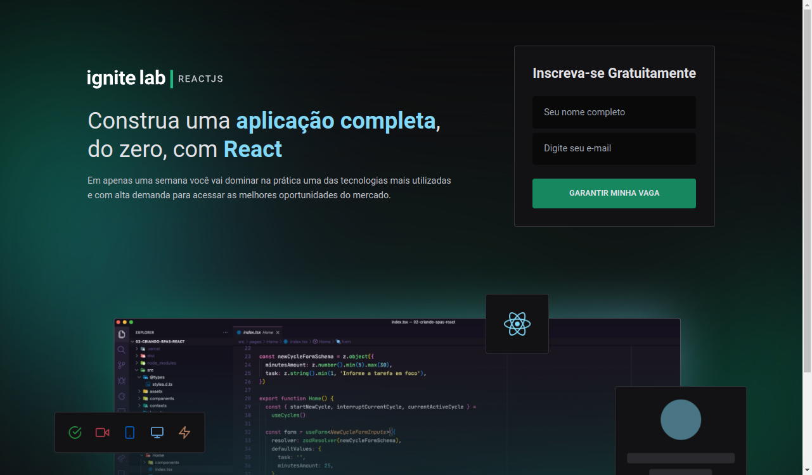
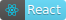
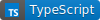
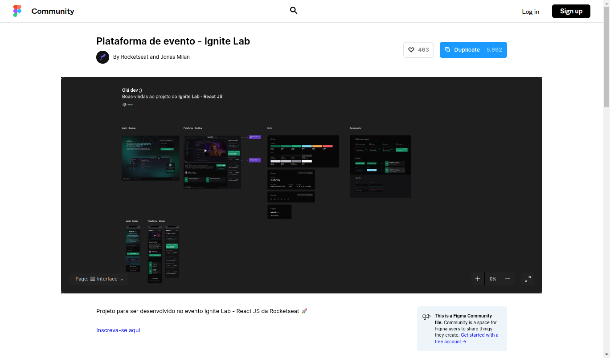

<h2 align="center">
   Ignite Lab - ReactJS | 
</h2>

<p align="center">




</p>

---

O Ignite Lab é um evento da Rocketseat totalmente online, gratuito e mão na massa, que aconteceu de 20 a 26 de junho com foco em ReactJS. Durante o evento foi desenvolvido uma aplicação chamada **Event Platform** cujo objetivo é permitir pessoas se cadastrarem no evento e possam assistir as aulas já cadastradas.

Projeto foi hospedado na Vercel. Acesse o **Event Plataform** desenvolvido [clicando aqui](https://ignite-lab-beige-zeta.vercel.app/).

<p align="center">
  <a href="#-projeto">Projeto</a>&nbsp;&nbsp;&nbsp;|&nbsp;&nbsp;&nbsp;
  <a href="#-como-rodar-o-projeto">Como rodar o projeto</a>&nbsp;&nbsp;&nbsp;|&nbsp;&nbsp;&nbsp;
  <a href="#-tecnologias">Tecnologias</a>&nbsp;&nbsp;&nbsp;|&nbsp;&nbsp;&nbsp;
  <a href="#-extensões-vscode">Extensões VsCode</a>&nbsp;&nbsp;&nbsp;|&nbsp;&nbsp;&nbsp;
  <a href="#-layout">Layout</a>&nbsp;&nbsp;&nbsp;|&nbsp;&nbsp;&nbsp;
  <a href="#-licença">Licença</a>
</p>

## 💻 Projeto

Uma plataforma de eventos, assim como as plataformas que utilizamos para hostear os eventos, como o próprio Ignite Lab.

Imagina o seguinte: Durante a semana vocês vão utilizar uma plataforma, desenvolvida pela Rocket, para assistir as aulas do Ignite Lab. A gente vai desenvolver essa plataforma durante essas aulas.

Plataforma vai permitir que as pessoas possam fazer uma inscrição e depois elas tenham acesso a um conteúdo que é um evento. Um evento possui aulas. Cada aula é liberada dia após dia.

As aulas que vão ser liberadas no futuro ficam bloqueadas.

Cada aula possui várias informações específicas de cada uma. Como título, descrição, professor, desafios, link para comunidade. Material complementar, wallpapers, comentários.

Todo style guide da plataforma pronto no Figma. É possível duplicar o layout [clicando aqui](https://www.figma.com/community/file/1120711251998877938).

## 🛑 Pré-requisito

Crie uma conta no [GraphCMS](https://app.graphcms.com/) e clone o schema base [clicando aqui](http://rseat.in/lab-graphcms).

## 🧭 Como rodar o projeto

**Clone este repositório**

```bash
git clone https://github.com/vitorsemidio-dev/ignite-lab
```

**Acesse a pasta**

```bash
cd ignite-lab
```

**Instale as dependências**

```bash
npm install
```

**Execute a aplicação**

```bash
npm run dev
```

## 🎉 Extensões VsCode

- [GraphQL](https://marketplace.visualstudio.com/items?itemName=GraphQL.vscode-graphql)
- [Tailwind CSS IntelliSense](https://marketplace.visualstudio.com/items?itemName=bradlc.vscode-tailwindcss)
- [PostCSS Language Support](https://marketplace.visualstudio.com/items?itemName=csstools.postcss)

## 🚀 Tecnologias

Esse projeto foi desenvolvido com as seguintes tecnologias:

- [Appolo](https://www.apollographql.com/)
- [GraphCMS](https://graphcms.com/)
- [GraphQL](https://graphql.org/)
- [ReactJS](https://pt-br.reactjs.org/)
- [Tailwind](https://tailwindcss.com/)
- [TypeScript](https://www.typescriptlang.org/pt/)
- [Vite](https://vitejs.dev/)

## 🔖 Layout

Você pode visualizar o layout do projeto através [desse link](https://www.figma.com/community/file/1120711251998877938). É necessário ter conta no [Figma](https://figma.com) para acessá-lo.



## 📝 Licença

Esse projeto está sob a licença MIT. Veja o arquivo [LICENSE](LICENSE) para mais detalhes.
